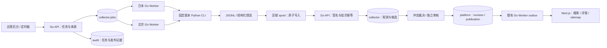

# 采集任务与运行架构

## 1. 现状与目标

现有服务包括公开 Next.js、运营 Next.js、Go API、日本 Go Worker、Python 媒体处理、PostgreSQL 三 Schema 与 Python fixture CLI。`collector.jobs` 和来源连接器表已预留，真实采集执行仍关闭。本轮新增离线 `collector.demo` 与独立静态演示，未把 Python 接入生产 Worker。



图为目标结构。Python 无 PostgreSQL、S3 或管理员凭据；Worker 以固定参数数组启动已审核脚本，不拼 shell 命令、不执行后台上传代码。北京结果通过日本接收 API 写入单库，区域配置用于任务分工。

## 2. 七种任务

沿用数据库已有枚举和[机器可读任务模板](../../data/collection/task-templates.json)。来源核验为所有真实网络任务的前置，图片任务另依赖媒体权利与既有上传准入。

| 类型 | 调度起点 | 处理范围 | 产出与完成条件 |
| --- | --- | --- | --- |
| `source_probe` | 首次 / 每周 | 允许的代表页与规则证据 | 目标 HTTP、结构版本与规则核验；不返回资料发布成功 |
| `work_incremental` | 手动，稳定后每日 | 受控列表窗口 | 候选批次接收且游标原子提交 |
| `performer_incremental` | 按需 / 每周 | 已知公开人物线索 | 名称/别名候选；身份与关系未自动批准 |
| `work_detail` | 人工点选 / 缺失字段 | 明确外部 ID 集合 | 字段证据、差异、缺失原因 |
| `image_candidates` | 独立核验后人工点选 | 已选作品 | 仅媒体候选；首期关闭 |
| `reconcile_source` | 每周 / 更正线索 | 已收录来源对象 | hash、差异和不可达信号；单次 404 不自动下架 |
| `retry_dead_job` | 修复后人工 | 原任务参数快照 | 新任务 ID、原任务关联和重跑理由 |

具体时区/每日窗口在部署阶段固定为 UTC 记录，运营页转换本地时间。没有源站更新时间时，不能假造增量游标；可用已验证的稳定外部 ID、列表窗口与重叠回扫，分页排序变化导致的遗漏通过周对账检测。只有整个窗口所有分片已持久化才提交游标，失败续跑重放重叠页。

## 3. 状态、租约与暂停

```text
pending → running → completed
                  → retry → running
                  → dead
                  → cancelled
```

来源暂停使用 `source_connectors.enabled=false` 或 `sources.status=paused`，不向现有 job 状态枚举添加未经迁移的 `paused`。403、登录/验证码和结构变化可暂停该来源；后台展示来源停用原因与已受影响任务。

任务领取按 region、能力与允许版本筛选，通过数据库短事务 `FOR UPDATE SKIP LOCKED` 与租约实现；建议租约 120 秒、30 秒心跳。单 Worker 每次一个采集子进程。过期租约重领时生成新的租约 token / generation；旧持有者的完成和游标提交必须拒绝。现有表缺少完整 fencing 字段，B2 需评审迁移，不能把 schema 预留当作已经解决陈旧写入。

取消先记录期望状态并审计，Worker 中止后续请求，给 CLI 限时退出再结束进程；已接收的候选保持证据，不能靠取消撤销先前发布。全局关闭阻止新领取；在途请求不能保证立即撤销。

## 4. 批次与跨区恢复

spool 使用临时文件→flush/fsync→原子 rename，再登记 manifest；记录 job/batch/source/版本、compressed 与原始字节数、hash、重试时间。上传前签名，重传复用同一 batch ID、幂等键及内容；回执丢失保留原包，不新建批次逃避幂等。

Go API 检查签名、时间窗、nonce、区域、来源准入、租约 token、包长、解压上限、Schema 与 hash。在事务中写入 batch、source_records、normalized_records、审核候选与审计；同键异 payload 返回 409。首次接收结果一旦持久化，重试返回原回执。完成任务和游标更新须验证所有分片计数，确保“任务完成”不丢失未上传包。

断网继续保留 spool，到磁盘/容量上限暂停新采集。建议每区域 spool 硬上限 1 GiB、磁盘 80% 预警、90% 停止新增；这是设计预算，需根据磁盘核定。服务器确认并本地落回执后方可回收已完成包；未确认包不因普通 TTL 删除。原始 HTML 快照仅限允许保存内容，建议私有 7 天后清理，保留受控字段证据/hash；期限正式实施前与现有权利/下架流程核对。

## 5. 错误矩阵与限额

| 情况 | 自动动作 | 恢复方式 |
| --- | --- | --- |
| DNS、TLS、连接超时、5xx | 30 秒起指数退避，最多 5 次，总预算不扩大 | 到期重试；超限 dead |
| 429 | 解析 Retry-After，不提前请求；最多 3 次 | 延后到允许时间 |
| 401/403、登录或验证码 | 停止该来源，不把 HTML 当作品解析 | 人工核验访问范围 |
| 必填锚点消失 / 非作品页 | `SCHEMA_CHANGED`，隔离连接器版本 | 补 fixture、修复、发新版本 |
| 批次同键不同 hash | 409，停止该批次 | 人工核对原包，不能自动换键 |
| spool 满 / 磁盘 90% | 停止新增，保留未确认包 | 恢复传输或安全清理已确认包 |
| PostgreSQL 或接收 API 不可用 | 保留 spool，重试原包 | 依赖恢复后继续 |
| 公开 API 性能下降 | 停止新采集任务 | 运维复核后恢复，公开查询优先 |

起步请求预算见[来源设计](./SOURCE_RESEARCH.md)。重复请求、重试、重定向和失败请求都计入预算。解压后响应也必须受字节上限约束。所有重定向重新验证主机、地址及路径，不允许用户反馈 URL 直接进入执行路径。

日本资源建议为一个 CLI、256 MiB 内存起步、10 分钟硬超时；不与备份/批量发布争抢数据库连接。记录实际 CPU、RSS、耗时及公开 API P95 后调整，不能把建议值当负载测试结论。

## 6. 拟开发接口与事务边界

以下是目标接口，**尚未加入当前 OpenAPI，也不能在本机正式 API 上调用**：

- 运营任务：`POST /ops/collection/jobs`、`GET /ops/collection/jobs`、`GET /ops/collection/jobs/{id}`、`POST /ops/collection/jobs/{id}/cancel`，由既有后台角色控制；创建必需幂等键。
- 区域任务：`POST /internal/collection/claim`、`heartbeat`、`complete`、`fail`；独立 HMAC、最小权限与网络范围，心跳/完成携带有效租约 token。
- 批次：`POST /internal/collection/batches`、`GET /internal/collection/batches/{id}`；返回已持久化回执与逐项错误摘要，不在成功响应中暗示公开发布。

来源配置与停用走独立 admin/owner 写接口；任务只引用配置版本，不接受任意 Python 路径、代理 URL 或网络凭据。正式接入时先修改源 OpenAPI、生成类型、实现 Go repository 和合同测试，再接运营页面。

## 7. 可观测性

记录 job_id、batch_id、来源、区域、版本、状态、错误码、输入/接收/拒绝/重复数、冲突数、游标推进、重试、字节、时长和租约过期；日志不含代理口令、Cookie、签名 URL 或整页 HTML。区分来源不可达、解析失败、接收失败和发布失败。

告警对应动作：单来源异常仅隔离来源；审核积压超过预先设定的处理能力则暂停新增增量任务，仍允许更正与权利下架。权利下架、公开服务、备份优先于新增数据。真实准确率需独立人工抽样，统计不能以 fixture 代替线上结果。
